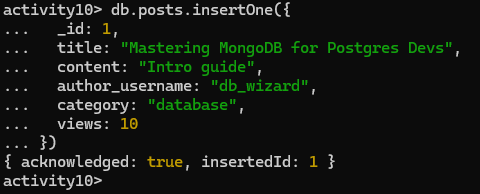
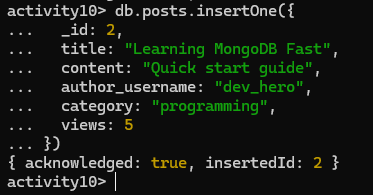
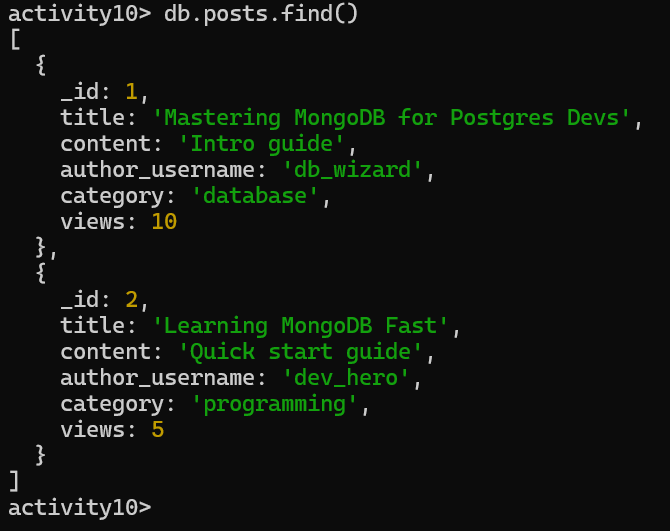
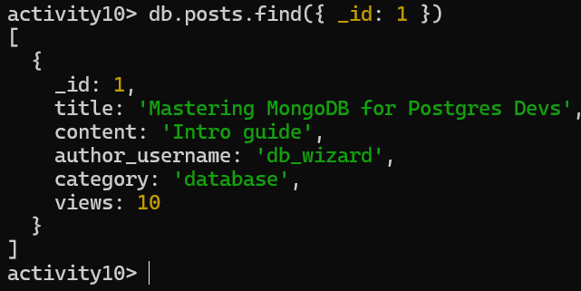
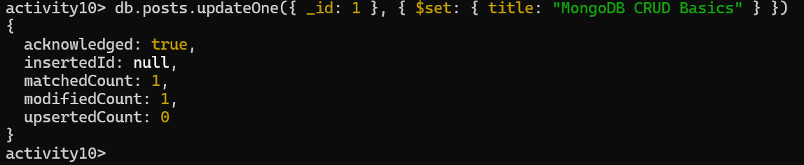
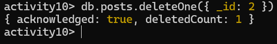

# Activity 10 Solution


## Part 1: Quick Mapping (Postgres -> MongoDB)

| PostgreSQL | MongoDB Equivalent |
|---|---|
| `INSERT INTO posts ...` | `db.posts.insertOne({ ... })` | 
| `SELECT * FROM posts WHERE title='...'` | `db.posts.find({ title: "..." })` |
| `UPDATE posts SET title='...' WHERE id=...` | `db.posts.updateOne({ _id: ... }, { $set: { title: "..." } })` |
| `DELETE FROM posts WHERE id=...` | `db.posts.deleteOne({ _id: ... })` |

## Part 2: Hands-on CRUD in MongoDB

Write the commands you executed and paste screenshots from Mongo shell after each command/block.

### 2.1 Setup

Commands:

```javascript
db.posts.insertOne({
  _id: 1,
  title: "Mastering MongoDB for Postgres Devs",
  content: "Intro guide",
  author_username: "db_wizard",
  category: "database",
  views: 10
})
```

Screenshot(s):
- 

### 2.2 Create

Commands:

```javascript
db.posts.insertOne({
  _id: 2,
  title: "Learning MongoDB Fast",
  content: "Quick start guide",
  author_username: "dev_hero",
  category: "programming",
  views: 5
})
```

Screenshot(s):
- 

### 2.3 Read

Commands:

```javascript
db.posts.find()
[
  {
    _id: 1,
    title: 'Mastering MongoDB for Postgres Devs',
    content: 'Intro guide',
    author_username: 'db_wizard',
    category: 'database',
    views: 10
  },
  {
    _id: 2,
    title: 'Learning MongoDB Fast',
    content: 'Quick start guide',
    author_username: 'dev_hero',
    category: 'programming',
    views: 5
  }
]
```
```javascript
db.posts.find({ _id: 1 })
[
  {
    _id: 1,
    title: 'Mastering MongoDB for Postgres Devs',
    content: 'Intro guide',
    author_username: 'db_wizard',
    category: 'database',
    views: 10
  }
]
```

Screenshot(s):
- 
- 
### 2.4 Update

Commands:

```javascript
db.posts.updateOne({ _id: 1 }, { $set: { title: "MongoDB CRUD Basics" } })
{
  acknowledged: true,
  insertedId: null,
  matchedCount: 1,
  modifiedCount: 1,
  upsertedCount: 0
}
```

Screenshot(s):
- 

### 2.5 Delete

Commands:

```javascript
db.posts.deleteOne({ _id: 2 })
```

Screenshot(s):
- 

## Part 3: Reflection (3-4 sentences)

1. One thing that feels easier in MongoDB CRUD:

- I find MongoDB easier for adding and updating data because I can just work with documents without worrying about strict table rules. It is very flexible and I can include only the fields I need. This makes it quick and simple to try out new ideas.

2. One thing that was clearer in PostgreSQL CRUD:

- PostgreSQL feels clearer when looking at data because the tables and columns are organized. I always know what fields exist and what type of data they hold. This makes it easier to avoid mistakes and plan queries.