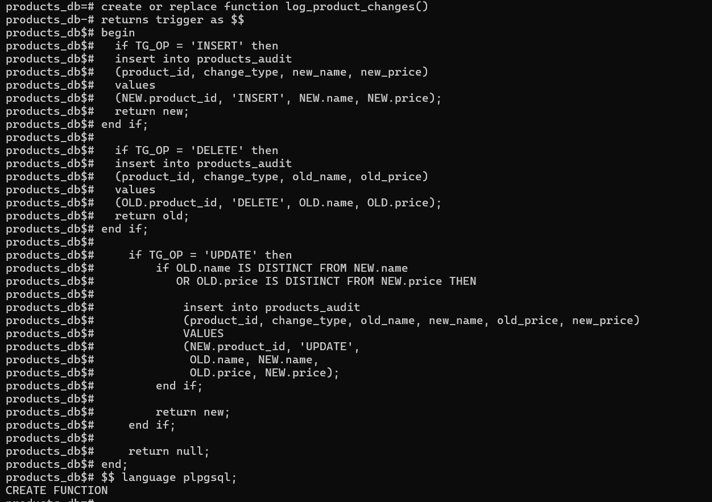
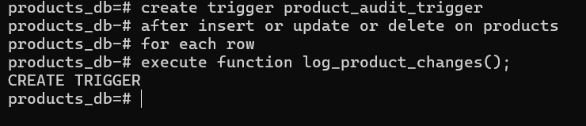
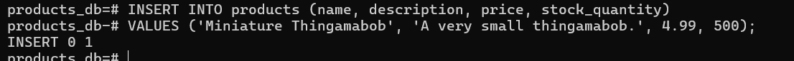
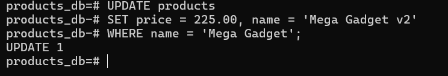
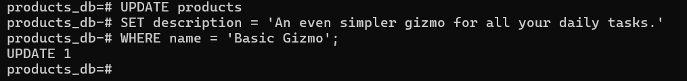
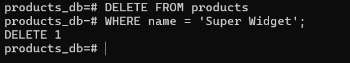
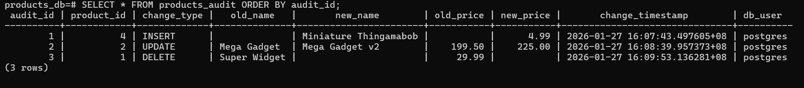

# Activity 3
# Task 1

# Task 2

# Task 3
# 1. Test the INSERT trigger

# 2. Test the UPDATE trigger (with a meaningful change)

# 3. Test an UPDATE with no meaningful change (should not create a log entry)

# 4. Test the DELETE trigger

# Task 4

