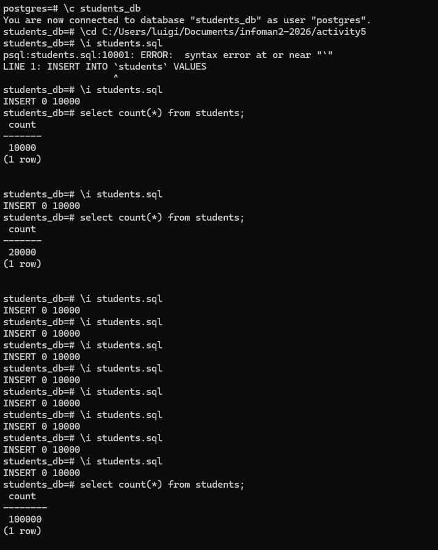
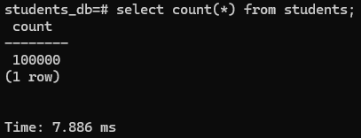
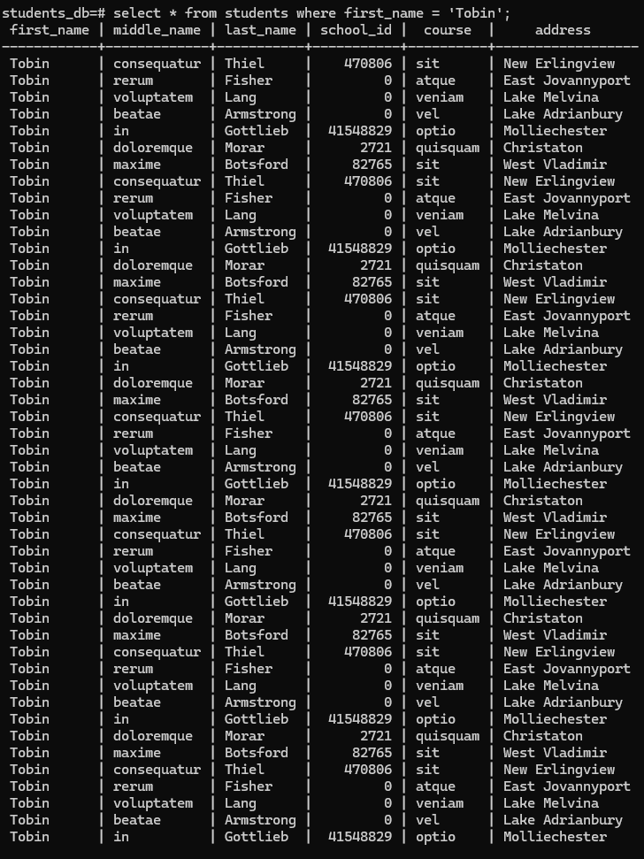
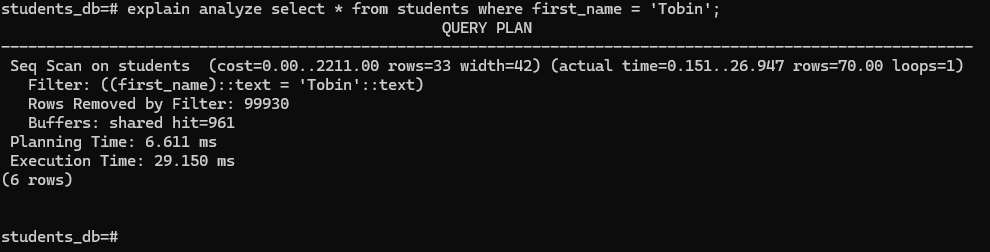
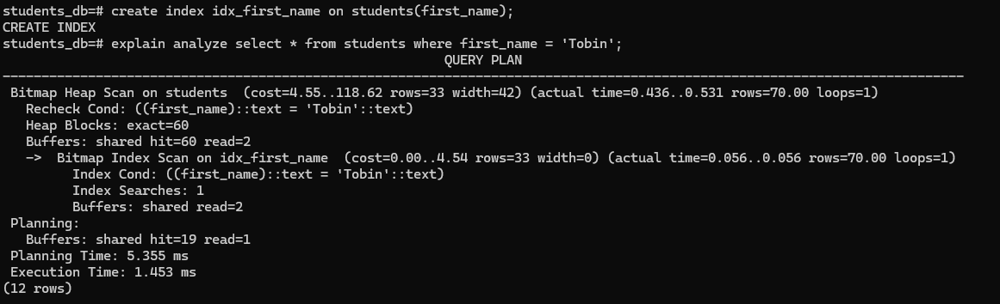
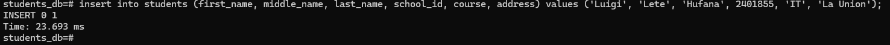

# Activity 5
# Part 1

# Part 2

#

# Part 3

# Part 4

# -----------------------------------------------------------------------------------------------

# Analysis Questions:
# Fill in the following with your recorded measurements.

# 1. Initial Data Insertion Time (1,000,000 rows): 7.886 ms
# 2. Query Execution Time (Non-Indexed): 29.150 ms
# 3. Query Execution Time (Indexed): 1.453 ms
# 4. Single Row Insertion Time (With Index): 23.693 ms

# -----------------------------------------------------------------------------------------------

# Answer the following questions:

# 1. How did the query execution time change after creating the index? Was it faster or slower? By approximately how much?
# - After creating an index on the first_name column, the query became much faster. Before the index, searching for first_name = 'Tobin' took 29.150 ms because PostgreSQL had to check every row in the table. Once the index was added, the query only took 1.453 ms, which is about 20 times faster.

# 2. Why do you think the query performance changed as you observed?
# - The query got faster because the index lets PostgreSQL jump straight to the rows that match the search instead of scanning the entire table. Without the index, it had to look at all 100,000 rows one by one. The index makes searching much more efficient, which explains the big drop in execution time.

# 3. What is the trade-off of having an index on a table? (Hint: Compare the initial bulk insertion time with the single row insertion time after the index was created).
# - Indexes make reading data much faster, but they can slow down writing data. Every time you insert, update, or delete a row, the index also needs to be updated. For example, after creating the index, inserting a single row took 23.693 milliseconds, which is a bit slower than it would be without the index. So, the trade-off is that queries get faster, but adding or changing data takes slightly longer.